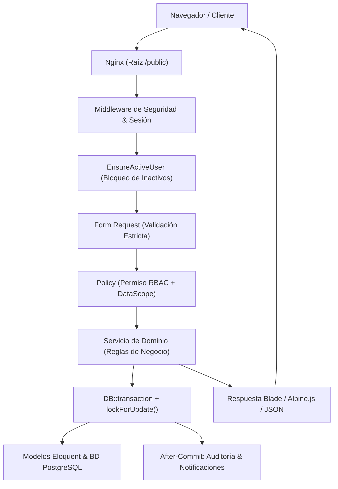

# Arquitectura del Sistema - NexusCRM

NexusCRM es un sistema de gestión de relaciones con clientes (CRM) de grado empresarial desarrollado con **Laravel 13**, **PHP 8.3/8.5** y **PostgreSQL 17**. Su diseño prioriza la integridad transaccional, el cálculo decimal exacto sin aproximaciones de coma flotante, la autorización multicapa en SQL y el aislamiento estricto de carteras entre equipos comerciales.

---

## 1. Diagrama de Flujo de la Petición

---

## 2. Capas y Responsabilidades

### A. Capa de Entrada y Enrutamiento
- **Nginx Web Server:** Sirve exclusivamente el directorio `/public`. Los archivos privados, ejecutables de framework, migraciones y código fuente permanecen completamente fuera del alcance web directo.
- **Middleware `EnsureActiveUser`:** Valida en cada petición si el usuario autenticado está activo (`status === 'active'`). Si una cuenta es desactivada administrativamente, sus peticiones subsiguientes se invalidan de inmediato sin permitir acciones residuales.
- **Form Requests:** Toda mutación (`POST`, `PUT`, `PATCH`) valida datos de entrada con reglas estrictas (tipos, rangos, existencia de llaves foráneas).

### B. Doble Capa de Autorización (RBAC + DataScope)
La autorización no depende únicamente de tener un permiso funcional:
1. **Permiso Funcional (RBAC):** Determina si el usuario tiene la capacidad de realizar la acción (ej. `companies.update`, `quotes.create`).
2. **Alcance de Datos (`DataScope`):** Filtra y revalida a nivel de base de datos (`whereIn('owner_id', $ids)`) si el registro específico pertenece a su ámbito:
   - **Global:** `Superadministrador` y `Administrador` (sin restricción de equipo).
   - **Equipo (Team):** `Gerente comercial` y `Supervisor` (registros propios y de miembros del mismo `team_id`).
   - **Propio (Own):** `Vendedor`, `Soporte`, `Consulta` y usuarios sin rol asignado (únicamente registros asignados a su ID).

> **Aislamiento `team_id = null`:** Dos usuarios que no pertenecen a ningún equipo (`team_id = null`) **nunca** se consideran del mismo equipo.

---

## 3. Principios de Integridad de Datos

### Precisión Numérica con BCMath
Para evitar los errores acumulativos de precisión propios del estándar IEEE-754 de coma flotante en PHP (`0.1 + 0.2 !== 0.3`), **todos los cálculos financieros y comerciales utilizan BCMath con cadenas de texto decimales a escala fija de 2 decimales**:
- `bcmul()`, `bcadd()`, `bcsub()`, `bcdiv()`, `bccomp()`.
- Centralizado en `App\Services\Quotes\QuoteCalculator` y `App\Services\Sales\SaleCalculator`.
- Las monedas distintas (USD, PEN, EUR) **jamás se suman entre sí** en un total combinado; los reportes y el forecast segregan los totales por divisa.

### Inmutabilidad de Snapshots Comerciales
Cuando una cotización, venta o factura interna es generada:
- Los precios unitarios, descripciones, tasas impositivas y descuentos se congelan como instantáneas (`QuoteItem`, `SaleItem`, `InvoiceItem`).
- Si posteriormente un producto cambia de precio o es archivado en el catálogo general, **los documentos emitidos previamente no sufren ninguna alteración**.

### Concurrencia y Transacciones Atómicas
- Las operaciones críticas (conversión de leads, transiciones de etapa de oportunidad, emisión de ventas y generación de facturas) se ejecutan dentro de bloques `DB::transaction()` con bloqueos pesimistas `lockForUpdate()`.
- Se previene la doble conversión de registros mediante estados protegidos: un lead ya convertido o eliminado rechaza cualquier segundo intento concurrente.
- Si ocurre una excepción a mitad de la operación, el rollback automático de la base de datos revierte todas las escrituras, garantizando cero registros huérfanos.

### Trazabilidad y After-Commit
- Los eventos de auditoría (`AuditLog`) y las notificaciones internas se despachan únicamente después de confirmada la transacción (`afterCommit`).
- Un rollback de base de datos **nunca** deja un registro de auditoría falso de "éxito" ni dispara notificaciones erróneas.
- La auditoría enmascara y sanitiza recursivamente contraseñas, secretos, tokens de sesión y `APP_KEY`.

---

## 4. Almacenamiento Seguro de Archivos Privados
- Disco aislado `private` ubicado en `storage/app/private/documents/`.
- Verificación estricta de extensiones y tipos MIME reales (PDF, PNG, JPEG, XLSX hasta 10 MB).
- Prevención de path traversal (`..`, separadores de ruta) y validación contra descompresiones maliciosas (zip-bomb en archivos XLSX).
- La descarga se realiza mediante streaming controlado (`PrivateDocumentController::download`) revalidando `documents.view` + `view` en la entidad padre + `DataScope` (prevención IDOR).
