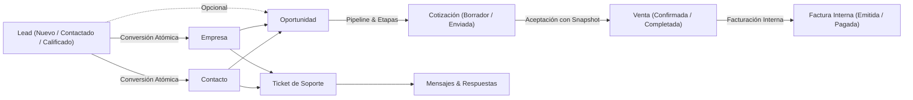

# Modelo de Datos y Entidades - NexusCRM

NexusCRM cuenta con un esquema relacional estructurado compuesto por **30 migraciones incrementales**, diseñado para soportar trazabilidad histórica, auditoría, precisión decimal y aislamiento multi-equipo.

---

## 1. Diagrama del Ciclo de Vida Comercial

---

## 2. Entidades Principales

### A. Núcleo Organizacional y Acceso
- **`users`:** Cuentas con campos `name`, `email`, `password`, `team_id` (FK anulable), `status` (`active`, `inactive`), `last_login_at` y `deleted_at`.
- **`teams`:** Equipos comerciales (`name`, `slug`, `description`, `status`). Un usuario pertenece como máximo a un equipo.
- **`roles` / `permissions` / `role_user` / `permission_user`:** Matriz RBAC centralizada con los 7 roles canónicos.

### B. Prospección y Cartera
- **`companies`:** Empresas cliente (`trade_name`, `legal_name`, `tax_id`, `email`, `phone`, `website`, `owner_id`, `status`).
- **`contacts`:** Personas de contacto asociadas a empresas (`first_name`, `last_name`, `email`, `phone`, `job_title`, `company_id`, `owner_id`).
- **`leads`:** Prospectos comerciales (`first_name`, `last_name`, `company_name`, `email`, `phone`, `source`, `status`: `new`, `contacted`, `qualified`, `unqualified`, `converted`, `owner_id`, `estimated_value`).
  - Al convertirse, registra `converted_at`, `converted_company_id`, `converted_contact_id`.

### C. Ventas y Operación
- **`pipelines` / `pipeline_stages`:** Embudo comercial y etapas con `probability` (0 a 100%), orden (`position`) e indicadores `is_won` y `is_lost`.
- **`opportunities`:** Oportunidades comerciales (`name`, `pipeline_id`, `pipeline_stage_id`, `company_id`, `contact_id`, `owner_id`, `amount`, `currency`, `probability`, `expected_close_date`, `status`: `open`, `won`, `lost`).
- **`products` / `product_categories`:** Catálogo de productos y servicios con `sku`, `price`, `tax_rate`, `unit`.
- **`quotes` / `quote_items`:** Cotizaciones comerciales. Cada ítem guarda un snapshot inmutable de `unit_price`, `tax_rate`, `description` y `subtotal`.
- **`sales` / `sale_items`:** Ventas formalizadas tras aceptación de cotización.
- **`invoices` / `invoice_items`:** Facturación interna administrativa (sin valor fiscal directo) para control de cobro.

### D. Soporte al Cliente
- **`tickets`:** Casos de soporte (`number`, `company_id`, `contact_id`, `assigned_to`, `created_by`, `category_id`, `subject`, `status`: `new`, `open`, `pending`, `resolved`, `closed`, `priority`: `low`, `medium`, `high`, `urgent`).
- **`ticket_messages`:** Hilo de conversación (`ticket_id`, `user_id`, `contact_id`, `type`: `reply`, `note`, `system`, `body`, `is_internal`).

### E. Trazabilidad y Archivos
- **`audit_logs`:** Registro inmutable de eventos (`user_id`, `auditable_type`, `auditable_id`, `action`, `old_values`, `new_values`, `ip_address`, `user_agent`).
- **`private_documents`:** Archivos adjuntos privados polimórficos (`documentable_type`, `documentable_id`, `original_name`, `file_path`, `mime_type`, `file_size`).
- **`notifications`:** Bandeja estándar de avisos internos (`notifiable_type`, `notifiable_id`, `data`, `read_at`).
- **`data_imports` / `data_import_errors`:** Registro de cargas masivas de datos y detalle de errores por fila.
